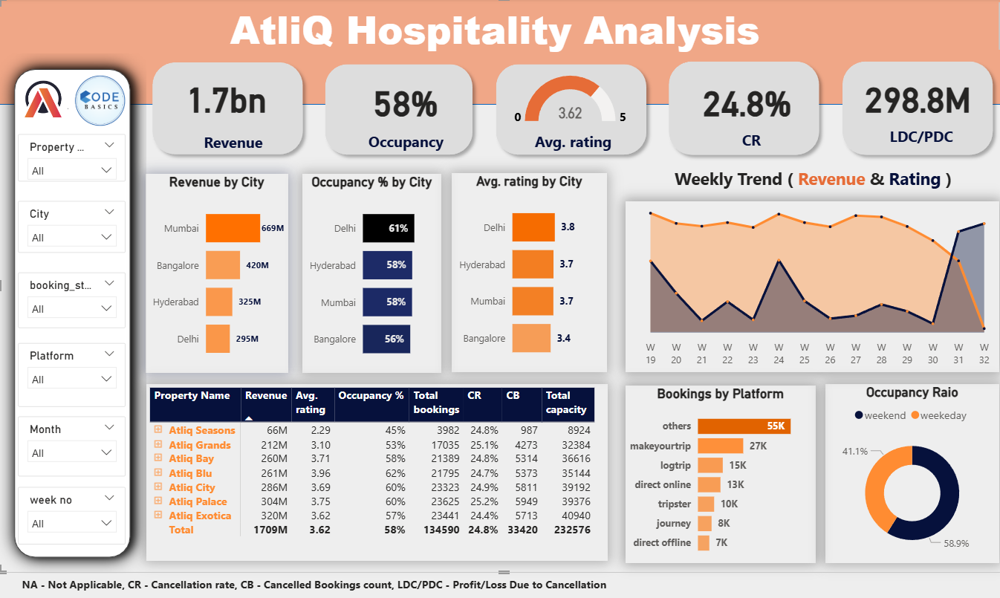
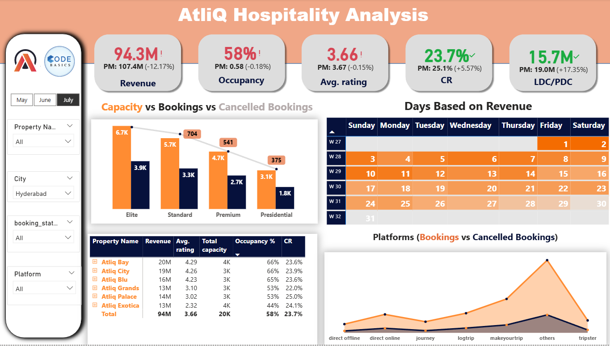
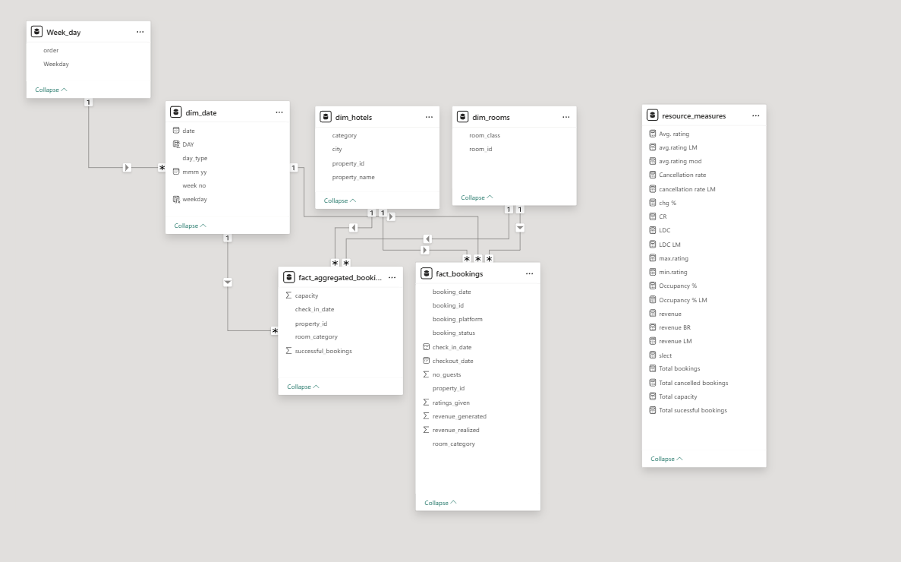

# 🏨 AtliQ Hospitality Analysis – Power BI Project

This project was created as part of the Codebasics September Resume Challenge. It focuses on solving a real-world business problem for a hospitality chain using Power BI and data analytics.

---

### 📌 Problem Statement

Client: AtliQ Grands – a luxury hotel chain operating across India for over 20 years.

Challenge:
Due to increasing competition and ineffective decision-making, AtliQ Grands is losing market share and revenue. The management has decided to adopt Business & Data Intelligence strategies but lacks an internal data analytics team.

They have approached a third-party data consultant to:

Build data models.

Generate actionable insights.

Design executive dashboards to improve strategic decisions.

---

### ✅ Objectives & Tasks

As the data analyst, I am tasked with:

📊 Creating Metrics: Build KPIs based on a predefined metric list.

🧩 Dashboard Design: Develop dashboards aligned with stakeholder-provided mock-ups.

💡 Insights Generation: Extract additional valuable insights not explicitly asked for.

---

# 🧪 Provided Mock-up Dashboard
## Overall Dashboard

## Monthly Dashboard

---

## 🧱 Data Model

---

### 📌 Key Insights & Features

Revenue trends and occupancy rates across locations

Segment-wise performance breakdown

Forecast vs Actual analysis

Dynamic filtering by geography, time, and customer segment

---

### 🛠 Tools & Tech Stack

**Power BI**: Dashboard development & DAX calculations

**SQL**: Data preprocessing and model building

**Excel**: Data cleaning & exploratory analysis

---

### 🙌 Acknowledgments

Special thanks to Codebasics for providing this opportunity through their resume project challenge.
Follow the Codebasics Resume Challenge for more real-world data projects.

