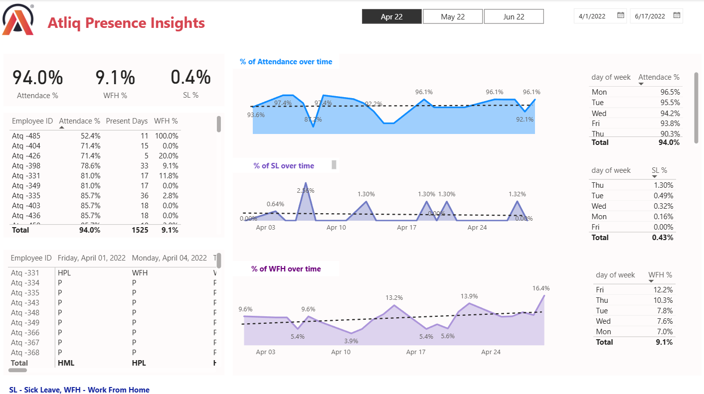

## 💼 HR Data Analytics Dashboard – Power BI Project

📊 Project Overview

This project focuses on building an HR Analytics Dashboard using Power BI and Excel to assist the Human Resources department in tracking and managing employee data effectively. The dashboard visualizes key HR metrics such as:

Employee Attendance %

Work From Home (WFH) %

Sick Leave (SL) %

Present Days by Employee

Attendance patterns by Day of Week

Trends over time for SL, WFH, and Attendance

By providing an interactive and insightful view of HR operations, this solution helps streamline workflows and improve decision-making.

---

🚀 Key Features

📅 Time Range Filters: Filter data by specific months or custom date ranges.

👨‍💼 Employee-Wise Metrics: View attendance, present days, and WFH % by employee ID.

📈 Trend Analysis: Visualize trends of attendance, sick leave, and WFH over time.

📊 Weekday Analysis: Analyze employee presence trends by the day of the week.

💡 Performance Insight: Identify peak absenteeism or WFH days, improving planning and workforce allocation.

---

🛠 Tools & Technologies

Power BI: For data visualization and dashboard design

Microsoft Excel: Used as a data source for employee records

DAX: For calculated measures and KPIs

---

💡 Business Impact

✅ Saved approximately 3–4 hours of manual HR work daily

✅ Helped identify attendance and leave trends

✅ Enabled better forecasting and team management

✅ Increased HR department efficiency and transparency

---

📂 Files Included

HR_Dashboard.pbix – Power BI dashboard file

Attendance sheet 2022-2023_masked.xlsx – Sample HR dataset (attendance, WFH, leave)

README.md – Project documentation

---

📷 Sample Visual (Dashboard Preview)

> 

---

📌 How to Use

1. Open HR_Dashboard.pbix in Power BI Desktop.

2. Load or update the data from Attendance sheet 2022-2023_masked.xlsx.

3. Use the date slicers and filters to explore the visuals.

4. Customize visuals or formulas based on your HR team's specific KPIs.

---

📬 Contact

Author: Charka Mahesh

